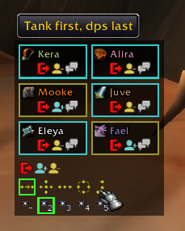
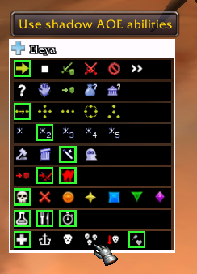

Bartcraft Mangosbot Addon

A lightweight control panel for CMaNGOS playerbots on Bartcraft.

This addon lets you open a bot roster, select an individual bot, and control that bot through buttons instead of typing every command manually. Individual bot buttons send commands to the bot whose menu is open, not your current target, so you can keep controlling a bot while targeting enemies, dummies, loot, or players.

Main Slash Commands
/bot

Opens or closes the bot roster.

/bot roster

Opens or closes the bot roster.

/bot refresh

Refreshes the currently selected bot’s strategy/status display.

/bot reset

Resets addon window positions.

/bot debug

Toggles the bot debug panel.

Main Bot Commands Used
Movement
follow
stay
flee
summon
Combat Orders
d attack my target
d add all loot
d loot
Role Control

The addon includes role buttons that wipe old combat roles before setting the new one.

co -heal
co -dps
co -dps assist
co -tank
co -tank aoe

Then it applies the selected role:

co +heal
co +dps
co +dps assist
co +tank
co +tank aoe
Quick Role Buttons

Healer:

co +heal

DPS:

co +dps
co +dps assist

Tank:

co +tank

AOE Tank:

co +tank
co +tank aoe
Strategy Helpers
co ?
nc ?
ll ?

Shows current combat, non-combat, and loot strategy status.

co +strategy

Adds a combat strategy.

co -strategy

Removes a combat strategy.

co ~strategy

Toggles a combat strategy.

nc +strategy
nc -strategy
nc ~strategy

Adds, removes, or toggles non-combat strategies.

Loot Settings
ll normal
ll gray
ll disenchant
ll all

Sets the bot’s loot behavior.

Formations
formation near
formation melee
formation arrow
formation chaos
formation line
formation queue
formation circle

Controls bot group formation.

Raid Target Icons
rti skull
rti cross
rti circle
rti star
rti square
rti triangle
rti diamond

Assigns raid target icons through bot commands.

